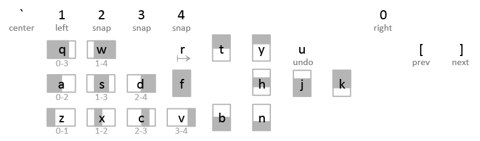

# tile

`tile` is a command-line window manipulation tool for macOS.

Features:
- Concise and easy to remember syntax
- Address apps by case insensitive substring of their names
  (e.g., `s` for *Safari*, `i` for *iTunes*, etc.),
  or, if no name is provided, act on the currently focused window
- Resize/reposition windows within one display, or send them to other displays
- Unlike some other window manipulation tools, it treats the horizontal and
  vertical dimensions differently
  - Horizontal: position and width addressed in terms of a `unit_width`
    (defaults to `Terminal.app`'s width at 80 columns without scrollbar)
  - Vertical: position and height set with multiples of halves or thirds of
    display height
- Integrate with hotkey tools that issue shell commands such as
  [khd](https://github.com/koekeishiya/khd);
  sample config file for *khd* is provided in `readme/.khdrc`, which results
  in the following keybinds (prefix ^⌘):

## How to use
- Clone, then `make`
- Copy just-built `tile` to `/usr/local/bin` for access from anywhere
  (optional)
- See `tile --help` for detailed command syntax
- Some examples:
  - `tile`: list open windows
  - `tile 0`: current window, position 0, width 1 (`unit_width`),
              height unchanged
  - `tile 1-`: current window, position 1, width extended to right end,
               height unchanged
  - `tile 1-3f sa`: position 1, width 2, full height, 0-th window of the
                    app whose name starts with `sa` (e.g., *Safari*)
  - `tile -2.5t fi 1`: position same, width extended to position 2.5,
                       top half, 1-th window of app `fi` (e.g., *Finder*)
  - `tile undo`: undo last action
  - `tile [` or `tile ]`: send current window to previous or next display
        (direction is meaningful only if there are 3 or more displays)
- `unit_width` and screen margins can be configured in `$HOME/.tilerc`
